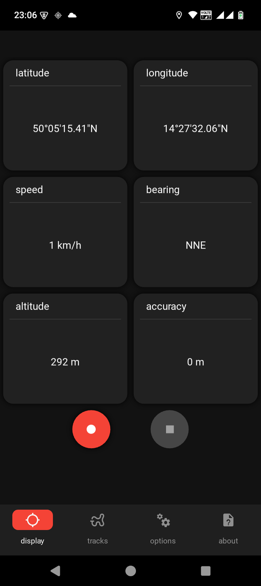
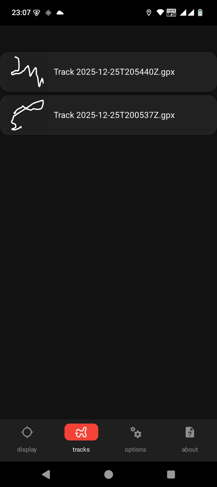
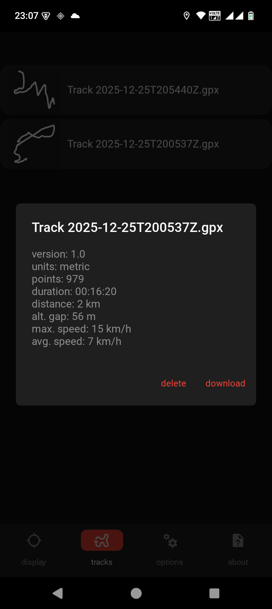
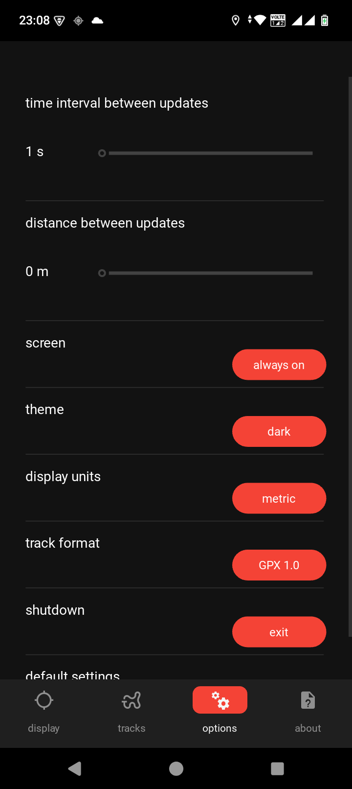
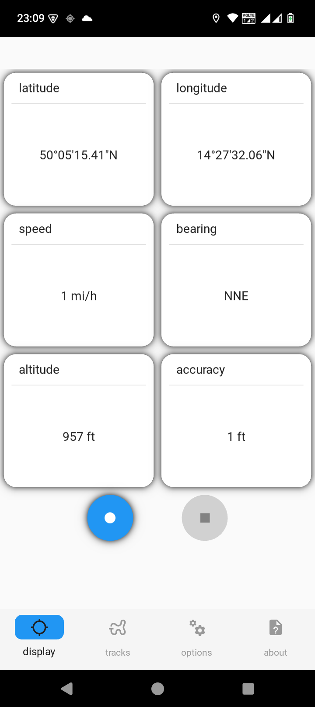
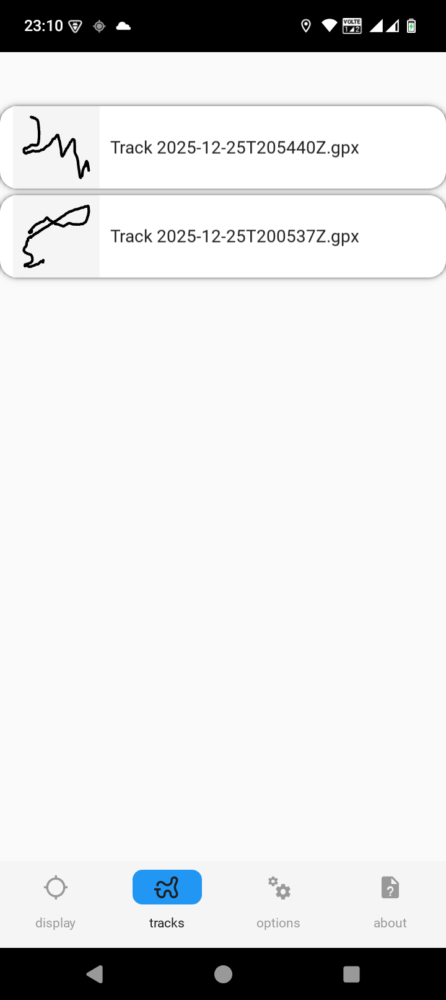
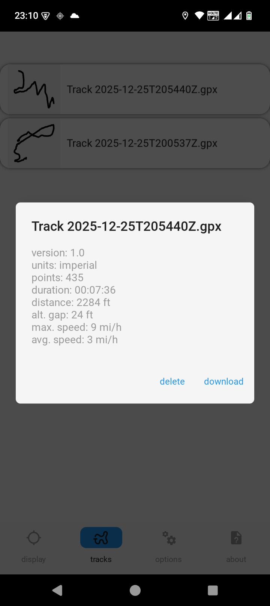
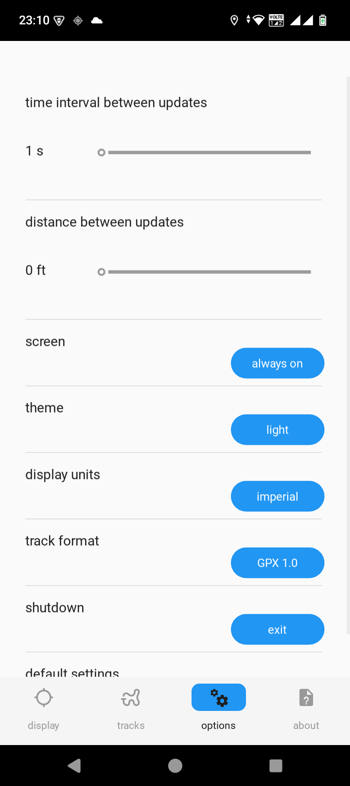

# Simple GPS Logger

A simple GPS tracking app that records your location coordinates and exports them as GPX or CSV files.
The app is open-source, privacy-conscious, and easy-to-use.

---

## Features

- Easy Tracking - One-tap start/pause/stop GPS logging.
- Dual Export - Save as GPX or CSV.
- Privacy First - All data stays on your device, no cloud uploads.
- Open-source (GPL-3.0).

---

## Platform & Technology

- Android
- Python
- Built using **Buildozer**

---

## Screenshots

Here are a few screenshots of the app in action:

<p float="left">
  
  
  
  
  
  
  
  
  
</p>


---

## Permissions

The app requests the following Android permissions:

- `ACCESS_FINE_LOCATION` – Required to record GPS coordinates while GPS logging is active.
- `FOREGROUND_SERVICE` / `FOREGROUND_SERVICE_LOCATION` – Used to run a visible foreground service while GPS logging is active, 
															ensuring continuous tracking and informing the user via a persistent notification.
- `POST_NOTIFICATIONS` – Used to display notifications related to active GPS logging.
- `INTERNET` / `ACCESS_NETWORK_STATE` – Used solely to display advertisements via Google AdMob.
- `WRITE_EXTERNAL_STORAGE` – Used to save exported GPX and CSV files to the device’s storage.

All permissions are used strictly for app functionality.

---

## Usage

1. Open the app
2. Start GPS logging
3. Stop logging when finished
4. Export your data as GPX or CSV

Exported files can be used in mapping or GIS software.

---

## License

Copyright (C) 2025 Juraj Sabo
This project is licensed under the GNU General Public License v3.0 - see the [LICENSE](LICENSE) file for details.

---

## Build & Installation (Development)

```bash
git clone https://github.com/jurajsabo/simple-gps-logger
cd simple-gps-logger
buildozer -v android debug
```


